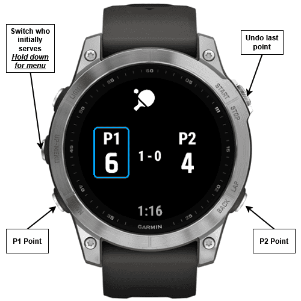

# Garmin Table Tennis Counter App

This is a hobby project designed for garmin watches to help you track scores, monitors serves and keeps count of sets.
The published app can be found at [Garmin Connect IQ Store](https://apps.garmin.com/sv-SE/apps/160ed59b-629c-467d-8612-53443544f6aa)

## Features

- **Point Tracking**: Keep track of individual points scored by each player.
- **Set Tracking**: Monitor the number of sets won by each player.
- **Serve Tracking**: Automatically track and switch the server during the match.

## Usage

## How to Use

1. Initially, when the match starts, press the **up button** to switch who serves.
2. Press the **down button** to give a point to player 1.
3. Press the **back button** to give a point to player 2.
4. Press the **start button** to undo the previous point, this can be repeated indefinitely.
5. Hold down the **up button** to enter the menu where the match can be restarted and the application can be exited.

## Supported devices
 
- Fenix 7 / 7 pro
- Fenix 6

Support for more devices will be added soon.

## Feedback

If you have any suggestions, questions, or requests for support for a specific device, or if you find a bug, please leave a review on the [Garmin Connect IQ Store](https://apps.garmin.com/sv-SE/apps/160ed59b-629c-467d-8612-53443544f6aa).